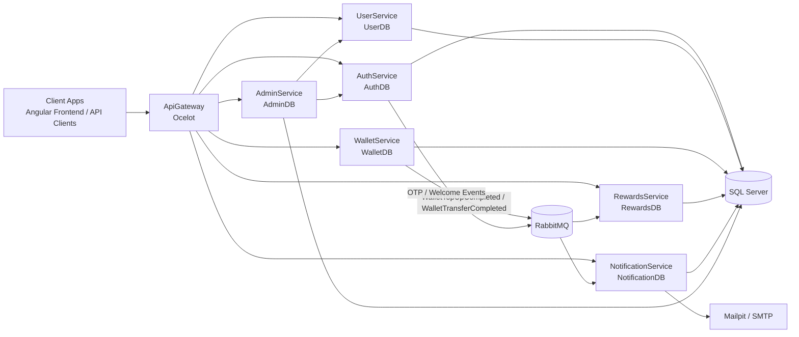

# ZyntraPay

ZyntraPay is a full-stack digital wallet and rewards platform built with .NET microservices and Angular.  
The system covers authentication, user profile/KYC, wallet operations, rewards, notifications, and admin governance through a single API Gateway.

## Table of Contents

- [Project Overview](#project-overview)
- [Architecture](#architecture)
- [Repository Structure](#repository-structure)
- [Tech Stack](#tech-stack)
- [Quick Start](#quick-start)
- [Run with Docker (Recommended for Full Backend)](#run-with-docker-recommended-for-full-backend)
- [API Overview](#api-overview)
- [Testing](#testing)
- [Documentation Index](#documentation-index)
- [Current Project Status](#current-project-status)
- [Contributing](#contributing)

## Project Overview

Core capabilities:

- JWT-based authentication and role-based authorization
- OTP-supported registration and password reset flows
- User profile and KYC workflows
- Wallet management (create wallet, top-up, transfer, transaction history)
- Rewards points and redemption workflows
- Notification delivery and read-state tracking
- Admin orchestration for KYC review, user status management, and dashboard reporting

Core architecture principles:

- API Gateway-first public access
- Database-per-service ownership
- Event-driven async processing using RabbitMQ
- Shared event contracts via `Shared.Events`

## Architecture

### Overall Architecture Diagram



### Runtime Components

| Component | Local Port | Responsibility | Database |
|---|---:|---|---|
| ApiGateway | 5000 / 5001 | Unified entry point and route forwarding | N/A |
| AuthService | 5002 / 5003 | Register, login, JWT, refresh token, user status | AuthDB |
| UserService | 5004 / 5005 | Profile and KYC | UserDB |
| WalletService | 5006 / 5007 | Wallet, top-up, transfer, ledger | WalletDB |
| RewardsService | 5008 / 5009 | Points, catalog, redemption | RewardsDB |
| NotificationService | 5010 / 5011 | Notification storage and delivery workflows | NotificationDB |
| AdminService | 5012 / 5013 | Admin orchestration and audit operations | AdminDB |

Notes:

- `5000/5002/5004/...` are the primary local HTTP ports used in run commands and Docker mapping.
- `5001/5003/5005/...` are also used in some app settings/docs (HTTPS variants or alternate launch profiles).

### Gateway Route Prefixes

- `/gateway/auth/*`
- `/gateway/user/*`
- `/gateway/wallet/*`
- `/gateway/rewards/*`
- `/gateway/notification/*`
- `/gateway/admin/*`

### Event-Driven Flows (RabbitMQ)

- Wallet top-up completed -> rewards points awarding + notification creation
- Wallet transfer completed -> notification creation
- Auth OTP / welcome events -> notification/email processing
- Admin KYC review actions -> downstream status update notifications

## Repository Structure

```text
ZyntraPay/
|- Backend/
|  |- src/
|  |  |- building-block/Shared.Events/
|  |  |- gateway/ApiGateway/
|  |  |- services/
|  |     |- AuthService/
|  |     |- UserService/
|  |     |- WalletService/
|  |     |- RewardsService/
|  |     |- NotificationService/
|  |     |- AdminService/
|  |- test/
|  |  |- AuthService.Tests/
|  |  |- UserService.Tests/
|  |  |- WalletService.Tests/
|  |  |- RewardsService.Tests/
|  |  |- NotificationService.Tests/
|  |  |- AdminService.Tests/
|  |  |- ZyntraPay.IntegrationTests/
|  |- Database/
|  |- Diagrams/
|  |- docker-compose.yml
|  |- ZyntraPay.slnx
|- Frontend/
|  |- zyntrapay-app/ (Angular)
|- Documentations/
```

## Tech Stack

### Backend

- .NET 8
- ASP.NET Core Web API
- Entity Framework Core
- SQL Server
- Ocelot API Gateway
- RabbitMQ
- JWT Bearer Authentication
- Swagger / Swashbuckle
- Polly (resilience in admin orchestration)

### Frontend

- Angular 21
- Angular Router
- Reactive Forms
- HttpClient + interceptor pattern

### Quality and Tooling

- NUnit (unit + integration tests)
- Docker and Docker Compose
- Mailpit (local email capture)

## Quick Start

### Prerequisites

- .NET SDK 8.x
- Node.js 20+ and npm 10+
- Docker Desktop (for SQL Server, RabbitMQ, Mailpit, and full stack)

### 1) Clone and Open

```powershell
git clone https://github.com/asadali2004/zyntrapay.git
cd ZyntraPay
```

### 2) Frontend Setup

```powershell
cd Frontend\zyntrapay-app
npm install
npm start
```

Frontend URL: `http://localhost:4200`

### 3) Backend Local Setup (Manual Service Run)

Start infrastructure first:

```powershell
cd Backend
docker compose up -d sqlserver rabbitmq mailpit
```

Restore/build solution:

```powershell
dotnet restore .\ZyntraPay.slnx
dotnet build .\ZyntraPay.slnx
```

Run services in separate terminals (recommended order):

```powershell
dotnet run --project .\src\services\AuthService\AuthService.csproj
dotnet run --project .\src\services\UserService\UserService.csproj
dotnet run --project .\src\services\WalletService\WalletService.csproj
dotnet run --project .\src\services\RewardsService\RewardsService.csproj
dotnet run --project .\src\services\NotificationService\NotificationService.csproj
dotnet run --project .\src\services\AdminService\AdminService.csproj
dotnet run --project .\src\gateway\ApiGateway\ApiGateway.csproj
```

Gateway URL: `http://localhost:5000`

## Run with Docker (Recommended for Full Backend)

From `Backend/`:

```powershell
docker compose up --build -d
```

Useful checks:

```powershell
docker compose ps
Invoke-WebRequest http://localhost:5000/health -UseBasicParsing
```

Stop stack:

```powershell
docker compose down
```

Stop and remove volumes:

```powershell
docker compose down -v
```

### Local Infrastructure URLs

- Gateway: `http://localhost:5000`
- RabbitMQ UI: `http://localhost:15672`
- Mailpit UI: `http://localhost:8025`
- SQL Server: `localhost,1433`

## API Overview

Base gateway URL examples:

- `http://localhost:5000/gateway`
- `https://localhost:5001/gateway`

Auth header for protected routes:

```http
Authorization: Bearer {token}
```

Standard error contract:

```json
{
	"message": "Readable error message",
	"errorCode": "STABLE_ERROR_CODE"
}
```

For full endpoint details and request/response examples:

- Use service Swagger endpoints through the gateway and service projects under `Backend/src/services/`.
- Review high-level design in [Documentations/ZyntraPay_HLD.pdf](./Documentations/ZyntraPay_HLD.pdf).

## Testing

Run all backend tests:

```powershell
cd Backend
dotnet test .\ZyntraPay.slnx
```

Run individual test projects:

```powershell
dotnet test .\test\AuthService.Tests\AuthService.Tests.csproj
dotnet test .\test\UserService.Tests\UserService.Tests.csproj
dotnet test .\test\WalletService.Tests\WalletService.Tests.csproj
dotnet test .\test\RewardsService.Tests\RewardsService.Tests.csproj
dotnet test .\test\NotificationService.Tests\NotificationService.Tests.csproj
dotnet test .\test\AdminService.Tests\AdminService.Tests.csproj
dotnet test .\test\ZyntraPay.IntegrationTests\ZyntraPay.IntegrationTests.csproj
```

Reference checklist:

- Backend test projects are available under `Backend/test/`.

## Documentation Index

- [README.md](./README.md) - repository-level overview and setup
- [Backend/README.md](./Backend/README.md) - backend scope and command entry point
- [Frontend/zyntrapay-app/README.md](./Frontend/zyntrapay-app/README.md) - Angular app usage
- [Documentations/ZyntraPay_HLD.pdf](./Documentations/ZyntraPay_HLD.pdf) - high-level architecture/design document

## Current Project Status

Based on the latest project docs and repository structure:

- Backend microservices are implemented with API gateway routing.
- Unit and integration test projects are present across all core services.
- Docker Compose is configured for complete backend + infra startup.
- Angular frontend application exists and is structured with `core`, `features`, and `shared` areas.
- API and architecture documentation are available in this README, project READMEs, and the HLD document.

## Contributing

Contributions are welcome. Please follow these standards:

- Keep changes simple and consistent with existing project style.
- Preserve fresher-friendly readability.
- Avoid over-engineering and unnecessary abstractions.
- Add/update tests for behavior changes.
- Update documentation when contracts or flows change.

---

If you are starting for the first time, begin with:

1. [README.md](./README.md)
2. [Backend/README.md](./Backend/README.md)
3. [Documentations/ZyntraPay_HLD.pdf](./Documentations/ZyntraPay_HLD.pdf)
